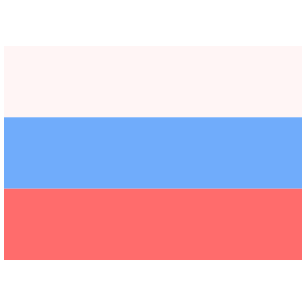

I am a humble web developer. I am just beginning my journey.

A list of my basic skills can be seen below.

<h2 align="center">My knowlage base:</h2>

  <!-- Laravel -->
  
  <!-- PHP -->
  
  
  <!-- HTML -->
  
  
  <!-- Css -->
  
  
  <!-- Bootstrap -->
  
  
  <!-- Scss -->
  
  
  <!-- Less -->
  
  
  <!-- Webpack -->
  
 

 
  

  <!-- Pug -->
  
  
  <!-- Babel -->
  
  
  <!-- Native JS -->
  
  
  <!-- JQuery -->
  
  
  <!-- Node js -->
  
   
  <!-- Git -->
  
  
  <!-- Postman -->
   
  
  <!-- Postgree -->
   
  
  <!-- MySQL -->
   
   
  <!-- MongoDB -->
   
  
  <!-- SQLite -->
   
 

 
 <h3 align="center">I usually use</h4>
 
 ---

 <!-- Zeplin -->
 
  
  <!-- Figma -->
 
  
 <!-- Avacode -->
 
  
 <!-- Sketch -->
 
  
  <!-- Photoshop -->
 
    
  <!-- Illustrator -->
 
  
  <!-- Premier Pro -->
 
  
 <!-- Vs Code -->
 
  
  <!-- PHP Storm -->
 

<h3 align="center">Languages</h3>

 
 

___

<h3 align="center">Contact me</h3>

  
  
  

